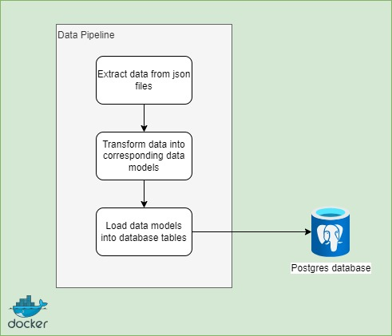
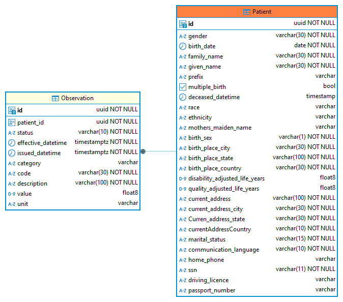

# Data Pipeline Assessment

[](https://github.com/JosephinJenifer12/emis-data-eng-assessment/actions/workflows/run-tests.yml)

This repository contains a data pipeline created using python to extract/transform patient related data from json files and load them into a relational database(postgres) with data integrity.

## High Level Design



## Steps to be followed to run this project
- Below environment variables should be added in .env file at the root of the repository
```
    DB_HOST=db
    DB_NAME=DB
    HOST_PORT=5432
    CONTAINER_PORT=5432
    DB_USER= <postgres username, default: postgres>
    DB_PASSWORD= <postgres username, default: postgres>
```
- Ensure Docker runs in your local
- Execute the following command from the root of the repository. This creates the postgres database and also executes the data pipeline script to process the data files
```
docker-compose up
```
- Data will be stored in the following tables in the postgres database:
    - Patient
    - Observation

## Data Model


